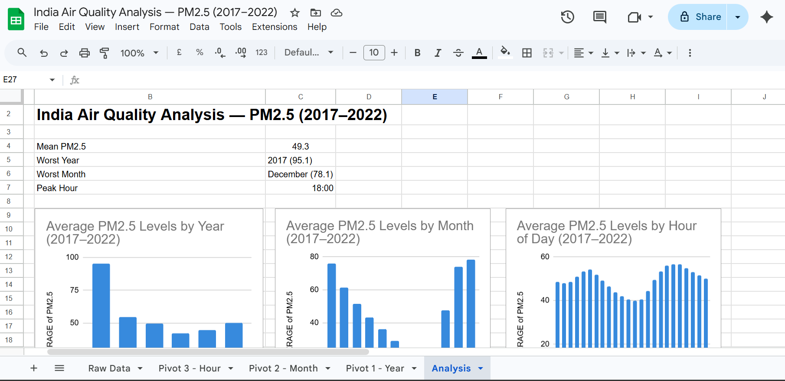

# India Air Quality Analysis — PM2.5 (2017–2022)

## Objective
To analyse hourly PM2.5 air pollution levels in India from 2017 to 2022 
and identify trends by year, month, and time of day.

## Dataset
- **Source:** Kaggle — India Air Quality Data
- **Size:** 36,192 hourly PM2.5 readings from 2017 to 2022

## Tools Used
Google Sheets — Pivot Tables, Charts, Dashboard

## Key Findings
- Average PM2.5 of **49.3** is over **3x** the WHO safe limit of 15
- **2017** recorded the highest pollution (95.1) while **2020** was the 
  cleanest (42.4) — likely due to COVID-19 lockdowns
- **December and January** are the most polluted months; July and August 
  (monsoon) are the cleanest
- **Evening hours (6 PM)** show peak pollution coinciding with rush hour; 
  noon is the cleanest time of day

Dashboard Preview

